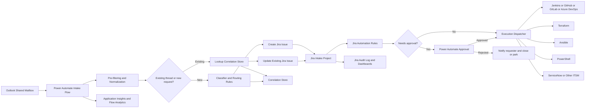
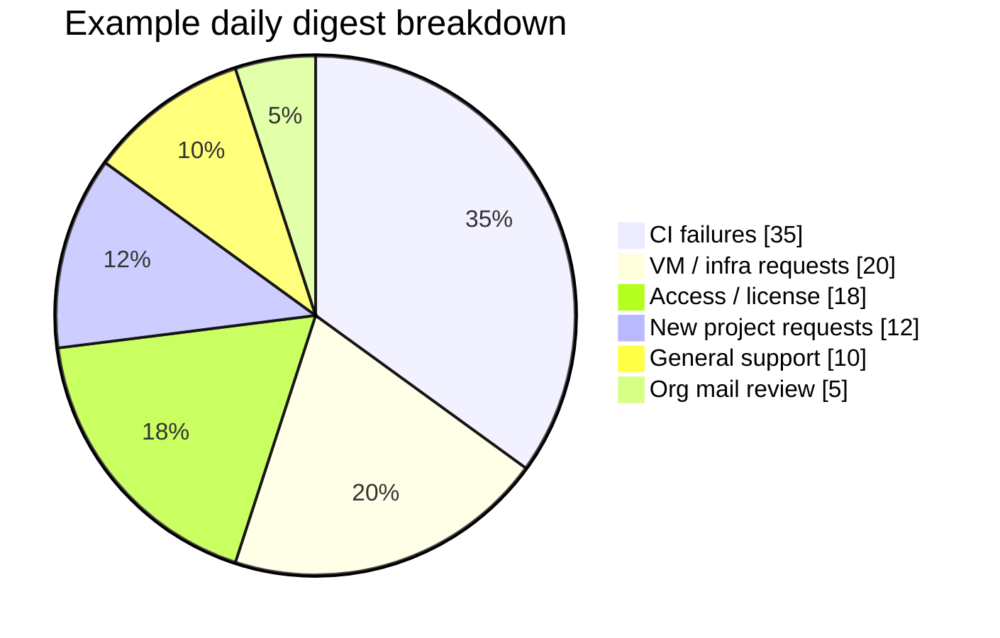

# Automated DevOps Intake from Outlook to Jira

## Executive summary

A complete DevOps Intake system for your environment should treat Outlook as the **front door**, Jira as the **system of record**, and a small execution layer as the **action engine**. The most practical design is a shared Outlook mailbox monitored by Power Automate, backed by Jira for request tracking, and extended with Azure Functions or Logic Apps only where the parsing, enrichment, or side effects become too custom for low-code alone. This approach aligns well with Microsoft 365-native email triggers and approvals, Jira issue creation and automation, and least-privilege identity controls in Microsoft Entra ID and Atlassian OAuth. citeturn20view2turn20view3turn20view4turn4search0turn29view1turn10search0

For a DevOps engineer, the system has to do more than “open tickets from emails.” It has to reduce toil without creating new operational risk. That means five design goals matter most: first, reliable triage of high-volume inbound mail; second, deterministic routing into the right Jira issue type with minimal mandatory fields at creation time; third, safe follow-up actions gated by approvals and RBAC; fourth, strong idempotency, retries, and observability; and fifth, a clean fallback path when parsing is ambiguous, an attachment is too large, or a connector silently skips a message. Microsoft documents that Outlook email triggers can filter at the trigger itself to conserve run quota, but they can also skip protected emails and messages over the mailbox-size/admin limit or 50 MB, whichever is lower; Power Automate concurrency control is off by default; Jira’s native Power Automate connector can fail when required Jira fields are complex types; and both Microsoft Graph and Jira APIs require explicit throttling handling with `429` plus `Retry-After`. citeturn20view2turn1search4turn22view3turn21view2turn23view0turn22view4

Because you have **lots of CI, minimal CD, virtual machines, developer mail overload, project-scoped requests, organizational mail, personal requests, and new-project requests**, the highest-value first release is not a giant everything-platform. It is a disciplined intake hub with these prioritized capabilities: CI failure intake and enrichment, VM and access/license request automation, new-project onboarding, and daily digest dashboards. CD-specific deployment gating can remain an open choice or later phase. That prioritization is an engineering recommendation based on the operating context you described. 

## Recommended operating model

The target operating model should be centered on a **single intake mailbox** such as `devops-intake@company.com`, or a small set of aliases that roll into one shared mailbox. Microsoft Graph supports primary and shared mailboxes, and Power Automate has triggers for new emails and shared mailbox scenarios; for edge cases not covered by connector operations, Microsoft documents an HTTP with Microsoft Entra ID workaround against Microsoft Graph. This is the cleanest way to avoid person-dependent inbox logic and to make ownership survivable when a specific engineer is on leave or changes role. citeturn3search16turn20view2turn26search9

The Jira side should be a **dedicated company-managed intake project** rather than an ad hoc team-managed space. Atlassian’s company-managed model gives you stronger control over workflows, work-type screen schemes, permission schemes, reusable custom fields, and centralized automation governance. Team-managed fields are local to the space and Atlassian documents limits and reuse constraints there, which makes enterprise intake designs harder to maintain at scale. citeturn24view2turn24view3turn24view1turn2search12turn8search11

The execution layer should stay thin. Use Power Automate for intake, approval steps, simple branching, and notifications. Use Azure Functions when you need custom parsing, correlation, CI enrichment, dedupe logic, or a more robust API client. Use Terraform, Ansible, PowerShell, Jenkins, GitHub Actions, GitLab, or Azure DevOps only as downstream executors, not as the intake brain. That separation keeps the operational model understandable. Microsoft explicitly supports solution-aware flows, environment variables, analytics, approvals, and integration with Application Insights; Azure Functions supports managed identities and runtime retry policies. citeturn17search2turn17search4turn20view4turn23view3turn22view1turn22view0

### Open choices

The following items remain open by assumption and should be treated as configurable rather than hard-coded decisions.

| Design area | Recommended stance | Reason |
|---|---|---|
| Jira platform | **Open choice:** Cloud preferred if OAuth 2.0 to Jira is required; Data Center requires different auth patterns | Jira Cloud supports OAuth 2.0 3LO scopes; Jira Data Center documents OAuth 1.0a and PAT/basic-style patterns instead. citeturn4search0turn29view1turn15search2turn15search1 |
| CI engine | Open choice: Jenkins, GitHub Actions, GitLab CI, Azure DevOps | All have official APIs for run status/log retrieval and re-run/trigger patterns. citeturn6search0turn18view4turn6search2turn6search3 |
| Cloud provider for VMs | Open choice | Terraform module structure abstracts the provider. citeturn7search8turn7search12turn7search0 |
| Secrets store | Azure Key Vault preferred in Microsoft-heavy environments | Power Platform environment variables can reference Key Vault secrets; Functions and App Service support secret/identity patterns. citeturn5search3turn5search21turn22view1 |
| Human approvals | Power Automate approvals first; Jira Service Management approvals if licensed and already in use | Power Automate approvals are native to M365; JSM approvals are strong if the product is available. citeturn20view4turn2search7turn2search3 |

### Tool choice comparison

| Tool | Best fit in this design | Strengths | Main caveats | Source |
|---|---|---|---|---|
| Power Automate | Primary intake, routing, auto-replies, approval workflows | Native Outlook/Jira connectors, email triggers, approvals, analytics, solution-aware ALM | License/run quotas vary by plan; trigger concurrency is off by default; some Jira create scenarios fail with complex required fields | citeturn20view2turn20view3turn20view4turn23view2turn22view3turn21view2 |
| Azure Logic Apps | Heavier integration hub, enterprise deployment control, consumption billing | Office 365 Outlook connector, large connector ecosystem, Azure deployment model | More platform engineering overhead than Power Automate for a mailbox-driven intake use case | citeturn5search0turn5search8 |
| Azure Functions | Custom classifiers, enrichers, idempotency service, API-heavy actions | Managed identity, code-level control, retry strategies | Requires software-engineering discipline and monitoring | citeturn22view1turn22view0 |
| n8n | Self-hosted alternative when you want less Microsoft dependency | Official Jira nodes and email trigger docs | Less native fit for Outlook/Entra/Jira governance in an M365-heavy enterprise | citeturn5search2turn5search14 |

**Recommended stack:** Power Automate as the default orchestrator, backed by Azure Functions for custom logic, with Jira as the source of truth and infrastructure tools invoked only after ticket creation and approval. That recommendation is an inference from the official capabilities above and from your Outlook-first operating model. citeturn20view2turn20view4turn22view1turn24view4

## Reference architecture and data flow

The architecture below is intentionally conservative. It separates the **mail intake path**, the **Jira state path**, and the **execution path** so that a transient failure in one does not corrupt another.



This design supports both connector-driven and Graph-driven ingestion. If you stay with Power Automate triggers, you get fast time-to-value and native filtering on folder, recipient, sender, importance, and attachment presence. If you need stronger event guarantees, custom thread handling, or mailbox-subset application permissions, Microsoft Graph supports change notifications for Outlook resources, lifecycle notifications to recover from lost subscriptions, and delta query for incremental synchronization. For shared/delegated folder change notifications, Microsoft documents that application permissions are required; the shared/delegated permission variants do not support that subscription scenario. citeturn20view2turn20view0turn20view1turn3search1turn18view2

A practical data flow for each message should look like this:

1. Mail lands in the shared mailbox.
2. Transport rules or Outlook rules can optionally pre-sort by alias or high-confidence organizational categories.
3. Intake flow reads the message metadata, body preview, key headers, attachments metadata, and mailbox context.
4. The message is normalized into a canonical request object.
5. A correlation step checks whether this email belongs to an existing Jira issue.
6. If there is no match, the classifier chooses an intake type and confidence.
7. Jira issue creation writes only safe-required fields.
8. Jira automation or child flows fill secondary data, request more info, or launch downstream approvals.
9. If approved, execution tools perform side effects and update Jira.
10. Every step logs correlation IDs and outcome telemetry. citeturn20view2turn27view0turn19view0turn24view4turn23view3turn23view4

### Data model for correlation

The most important edge-case defense is your correlation key strategy. Microsoft Graph documents that a message `id` changes when the item is moved unless you request immutable IDs, while `conversationId` identifies the conversation, and `internetMessageId` is the RFC-style message ID. For intake systems, that means you should not rely on Graph `id` alone. Use `Prefer: IdType="ImmutableId"` where possible, store `internetMessageId`, store `conversationId`, and keep a separate internal `intakeRequestId` in your own store. For outbound auto-replies you can also stamp a custom `x-` Internet message header when creating the mail, because Microsoft documents support for custom Internet headers on message creation. citeturn27view0

A minimal correlation store record should include:

| Field | Purpose |
|---|---|
| `intakeRequestId` | Internal immutable correlation ID |
| `mailboxAddress` | Distinguishes multiple intake mailboxes |
| `graphImmutableMessageId` | Stable lookup even if the message is moved |
| `internetMessageId` | RFC-style dedupe key across systems |
| `conversationId` | Thread grouping aid |
| `jiraIssueKey` | Primary ticket binding |
| `classifierVersion` | Auditability for routing changes |
| `normalizedFingerprint` | Hash of subject/body/project hints for duplicate suppression |

That schema is a design recommendation built directly around the documented Outlook message properties and the need for idempotent ticketing. citeturn27view0

## Jira project and workflow design

The intake project should be **company-managed** and purpose-built. Atlassian documents that work types, screens, screen schemes, workflow schemes, permission schemes, and issue security schemes are centrally manageable in this model, which is exactly what you want for a cross-team intake hub. Team-managed projects are attractive for speed, but they make reuse, field standardization, and governance more difficult at the scale you are aiming for. citeturn24view2turn24view3turn24view1turn2search12turn8search11

### Recommended issue types and custom fields

| Issue type | When to use | Core required fields at create time | Should side effects be allowed automatically? |
|---|---|---|---|
| CI Failure | Build/test notifications, repeated pipeline failures | Repository, CI tool, build URL, branch, severity | Yes for enrichment; no for destructive retries |
| VM Request | New VM, resize, disk, port, restart, patching | Project, environment, requested action | Only after approval |
| Access Request | Group membership, repo access, secret access | User, resource, project, requested role | Only after approval |
| License Request | Tool/subscription requests | User, product, justification, cost center if needed | Only after approval |
| New Project Request | New repo, CI template, infra bootstrap, docs | Project name, owner, business unit, repo platform | Partial automation after approval |
| Incident or Support | Troubleshooting, broken environment, generic DevOps ask | Affected service, urgency, environment | No, except diagnostics |
| Organizational Mail Review | Broadcasts or FYIs that may not need a ticket | Category, audience, action required | No |

The custom fields should be split into three groups: **intake metadata**, **routing metadata**, and **fulfillment metadata**. Keep the create screen short, because Microsoft’s Jira connector supports issue creation but documents limitations when required fields are complex types in the dynamic schema. If your Jira create screen forces rich objects or complex custom fields, the connector can fail; in that case, either make those fields not required on create or use an HTTP/custom-connector path against Jira REST instead. Atlassian’s create-issue metadata endpoints tell you what fields are actually settable for a given project/issue type, and those fields match the issue create screen. citeturn21view2turn19view0turn19view2

Recommended intake metadata fields:

| Field | Type | Why it exists |
|---|---|---|
| Source System | Select | Outlook, Jenkins, GitHub, GitLab, Azure DevOps, ServiceNow |
| Intake Request ID | Text | Dedicated idempotency key |
| Outlook Immutable Message ID | Text | Stable mailbox reference |
| Internet Message ID | Text | RFC message correlation |
| Conversation ID | Text | Thread grouping |
| Sender Email | Text | Routing and audit |
| Recipient Alias | Text | Alias-based intake rules |
| Category Confidence | Number | ML/rule confidence |
| Missing Information Needed | Multi-select | Enables precise auto-replies |
| Approval Required | Checkbox | Workflow branching |
| Approval Group | Group/User picker | Human gate |
| Payload JSON | Multi-line text / secure storage reference | For replay/debug, with PII controls |

### Screens, workflows, and schemes

Atlassian documents that work-type screen schemes let you map different screens to different work types for the same operation, and workflows are composed of statuses and transitions associated to specific work types and spaces. For this intake design, use different **Create**, **Edit**, and **View** screens per issue type. The Create screen should be intentionally sparse; the View screen can be verbose and include forensic metadata. citeturn24view2turn24view3

A practical workflow family looks like this:

- **New**
- **Classified**
- **Waiting for Info**
- **Approved**
- **Rejected**
- **Ready for Automation**
- **In Progress**
- **Blocked**
- **Done**
- **Canceled**
- **Duplicate**

For CI failures, shorten the path to **New → Classified → In Progress → Done/Blocked/Duplicate**. For VM, access, license, and new-project requests, insert **Approved/Rejected** before **Ready for Automation**. If Jira Service Management is licensed and appropriate, use its native approval step support; Atlassian documents that approval steps can be added to statuses in request workflows, and approvers do not need a JSM license just to approve. If JSM is not part of your environment, emulate approvals through standard Jira workflow states plus Power Automate approvals. citeturn2search7turn2search3turn20view4

### Permission model, RBAC, and security levels

Atlassian separates **permission schemes** from **issue security schemes**. Permission schemes control what users can do in a project; issue security schemes control who can see particular issues inside a project. Use both. Normal CI failures can often be visible to the team. Access requests, license requests, personnel-related tickets, and sensitive infra incidents should default to a locked security level such as `DevOps-Team`, `Approvers-Only`, or `Project-X-Secure`. citeturn24view1turn24view0

For operational governance, restrict who can create and manage Jira automation rules. Atlassian documents separate permissions for space-level and global automation, and global admins can disable rule authoring by project/space admins if needed. In an intake project, that is a very good idea. Treat automation changes like application code changes. citeturn25view0

### SLA and priority mapping

An intake system becomes useful the moment it standardizes urgency rather than asking humans to negotiate every ticket by email. A good starting model is:

| Incoming signal | Jira priority | Target response | Target resolution | Notes |
|---|---|---|---|---|
| Production CI failure on default branch or release branch | Highest | 15 min | 4 hours | Auto-page only if blast radius is high |
| Repeated CI failure on non-prod branch | High | 1 hour | 1 business day | Auto-link to previous failures |
| VM outage / env unavailable | Highest | 15 min | 4 hours | Approval bypass for break-fix only |
| New VM / resize / port request | Medium | 4 business hours | 2 business days | Approval normally required |
| Access request for active project blocker | High | 2 business hours | 1 business day | Sensitive issue security level |
| License request | Medium | 1 business day | 3 business days | Cost owner may approve |
| New project onboarding | Medium | 1 business day | 5 business days | Template-driven subtask bundle |
| Organizational FYI mail | Low or no ticket | N/A | N/A | Prefer digest, not issue creation |

This table is a recommended policy model rather than a vendor-documented default. In Jira, implement it through priority, due date, automation, and dashboards. Jira dashboards and gadgets can track these queues and unresolved-time charts, and Power Automate analytics can monitor flow success/failure and duration. citeturn16search0turn16search11turn16search12turn23view3

### Core Jira automation rules

At minimum, create these automation rules in Jira:

| Rule | Trigger | Core action | Why it matters |
|---|---|---|---|
| Intake enrichment | Issue created | Stamp defaults, set issue security, assign queue owner | Makes every new issue consistent |
| Missing info follow-up | Status becomes `Waiting for Info` | Comment + email template, set due date, remind after 24h | Prevents silent stalls |
| Approval gate | Status enters `Approved` | Post webhook or signal dispatcher | Safe handoff to execution |
| Execution outcome sync | Incoming webhook or external update | Add comment, transition status | Keeps Jira authoritative |
| Escalation | SLA breach or due-date threshold | Raise priority, notify on-call/lead | Reduces dead queues |
| Duplicate suppression | Issue created with same fingerprint or active thread | Link/close duplicate | Prevents alert storms |

Atlassian documents automation as triggers, conditions, and actions, and supports webhook-based triggering from third parties. That makes it suitable both for internal rule logic and for external execution callbacks. citeturn24view4turn8search12

## Email ingestion, classification, and responder logic

The classification pipeline should prefer **clear deterministic rules first**, then **ML only where rules are weak**. That is both cheaper and more debuggable.

### Parsing hierarchy

Use this order of operations:

1. **Explicit subject tokens** such as `[CI]`, `[VM]`, `[ACCESS]`, `[LICENSE]`, `[NEWPROJECT]`.
2. **Alias / recipient routing**, for example `devops-ci@`, `devops-vm@`, `devops-access@`.
3. **Sender routing**, especially for system mail from Jenkins, GitHub, GitLab, Azure DevOps, ServiceNow, or internal IT systems.
4. **Keyword and regex rules**.
5. **Historical sender-project mapping**.
6. **ML/NLP classifier**.
7. **Human triage queue** when confidence stays below threshold.

Microsoft recommends filtering mail properties in the trigger itself where possible, because adding conditions later still consumes run quota. That matters in your high-volume mail environment. Also enable trigger concurrency control deliberately rather than leaving it in the default “run as many as possible” mode. citeturn20view2turn22view3

### Regex library and feature extraction

The following examples are implementation suggestions:

```regex
# Jira key already present in subject or body
\b([A-Z][A-Z0-9]+-\d+)\b

# Jenkins build URL
https?:\/\/[^\/]+\/job\/[^\/]+(?:\/job\/[^\/]+)*\/\d+\/?

# GitHub Actions run URL
https?:\/\/github\.com\/[^\/]+\/[^\/]+\/actions\/runs\/\d+

# GitLab pipeline URL
https?:\/\/[^\/]+\/[^\/]+\/[^\/]+\/-\/pipelines\/\d+

# Azure DevOps build URL
https?:\/\/dev\.azure\.com\/[^\/]+\/[^\/]+\/_build\/results\?buildId=\d+

# Git SHA
\b[0-9a-f]{7,40}\b

# Obvious stack-trace frames
(?:Exception|Error): .+|at\s+[\w\.$_]+\([A-Za-z0-9_\.]+:\d+\)
```

Suggested ML feature set:

| Feature family | Examples |
|---|---|
| Subject features | n-grams, explicit prefixes, environment words, urgency words |
| Sender features | exact sender, domain, mailbox class, system-sender allowlist |
| Body features | build/test vocabulary, access/license vocabulary, VM spec vocabulary |
| Link features | Jenkins/GitHub/GitLab/Azure DevOps URL patterns |
| Attachment metadata | filename patterns like `junit.xml`, `build.log`, `terraform-plan.txt` |
| Historical behavior | sender-to-project frequency, previous classified outcomes |
| Time features | work hours, release window, weekend |
| Routing context | alias used, folder landed in, recipient mailbox |

If you want an M365-native classifier, Microsoft documents AI Builder category classification for Power Automate and Power Apps. That is a reasonable option for a first-generation business classifier, but it adds licensing and training-data concerns. citeturn13search2turn13search0turn13search12

### Email-to-ticket mapping rules

The mapping rules should be strict enough to prevent thread drift:

| Scenario | Action |
|---|---|
| Subject/body already contains a Jira key | Update that issue, unless sender is unauthorized |
| `internetMessageId` already seen | Ignore as duplicate |
| `conversationId` matches an open issue thread and sender belongs to same request context | Append comment/update existing issue |
| System mail from CI sender with new job/build URL | Create or merge into CI Failure ticket based on repo + branch + failure fingerprint |
| Access/license/VM/new-project request with no match | Create new issue |
| Organizational mail with no action keywords | Route to digest queue or non-ticket review queue |
| Low-confidence classification | Create `Needs Triage` issue or park in manual review list |

This rule set is centered around the documented Outlook message properties `conversationId`, `internetMessageId`, immutable IDs, and message headers. citeturn27view0

### Auto-reply and missing-information logic

The auto-reply system should be useful, not polite theater. A DevOps engineer wants fewer back-and-forth loops and fewer vague requests. So each issue type gets a **missing-info checklist** and a response template that mirrors the Jira fields.

A good **new-ticket acknowledgment** template:

```text
Subject: Received: ${category} request -> ${jiraKey}

Hello ${displayName},

Your request has been captured as ${jiraKey}.

Detected category: ${category}
Project: ${projectOrUnknown}
Environment: ${environmentOrUnknown}
Priority: ${priority}
Next step: ${nextStep}

If you reply to this email, include the ticket key in the subject.
```

A good **missing-info** template for VM requests:

```text
Subject: Action needed for ${jiraKey}: missing VM request details

We captured your VM request, but automation cannot continue until the following fields are provided:

- Project
- Environment
- OS
- CPU / RAM / Disk
- Expected lifetime or expiry date
- Business owner / approver

Reply in this format:
Project:
Environment:
OS:
CPU:
RAM:
Disk:
Expiry date:
Approver:
```

A good **CI failure** reply template:

```text
Subject: ${jiraKey}: CI failure captured

We detected a CI failure and created ${jiraKey}.

Repository: ${repo}
Branch: ${branch}
Build URL: ${buildUrl}
Failure signature: ${signature}
Stack trace summary: ${summary}

If this is a known flaky failure, reply with:
Flaky: yes
Known cause:
Preferred action:
```

Microsoft Graph `sendMail` supports JSON or MIME, allows attachments in JSON mode, and returns `202 Accepted`; Microsoft notes that acceptance does not guarantee the backend delivery process has completed, so your notification layer should treat send attempts and actual downstream request processing as separate concerns. citeturn18view1

### Escalation rules

Escalation should be data-driven, not inbox-driven. Recommended triggers:

| Condition | Escalation action |
|---|---|
| `Waiting for Info` for more than 24 hours | Reminder to requester |
| `Waiting for Info` for more than 72 hours | Transition to `Pending Closure` |
| CI failure on default branch unresolved for 1 hour | Notify repo owner and lead |
| Same failure fingerprint repeats 3 times in 24 hours | Raise severity and open “chronic failure” issue |
| Approval pending over SLA | Notify approver’s backup group |
| Automation execution failed twice | Stop retries, set `Blocked`, create operator-visible alert |

## Fulfillment automation patterns

### CI failure handling

This is likely your highest-value automation area because you have much more CI than CD. Treat CI emails as **enrichment triggers**, not as the final source of truth. The mail should get you a build URL, branch, repository hint, and rough failure summary; then your execution layer should call the CI system’s official API to fetch authoritative details, logs, or re-run actions. Jenkins documents a Remote Access API; GitHub documents workflow run and job APIs including log viewing and job re-run; GitLab documents jobs and pipelines APIs; Azure DevOps documents Build APIs and log retrieval. citeturn18view3turn18view4turn6search2turn6search7turn6search3

A good CI failure issue should extract:

- repository
- pipeline/job name
- branch
- commit SHA
- build/run ID
- build URL
- failure signature
- top stack trace lines
- previous occurrence count
- suspected owner from CODEOWNERS or project mapping

This workflow should also suppress noisy duplicates. If build 101, 102, and 103 all fail with the same normalized failure signature on the same branch within the same time window, update one rolling ticket instead of opening three. That is an engineering recommendation, not a vendor default.

A Jenkins trigger example using its documented remote API style:

```bash
curl -X POST \
  "https://jenkins.example.com/job/devops-remediate/buildWithParameters?JIRA_KEY=OPS-123&ACTION=rerun_failed_stage" \
  --user "svc_devops:${JENKINS_API_TOKEN}"
```

A GitHub Actions re-run example follows GitHub’s documented job re-run endpoint pattern:

```bash
curl -L \
  -X POST \
  -H "Accept: application/vnd.github+json" \
  -H "Authorization: Bearer ${GITHUB_TOKEN}" \
  -H "X-GitHub-Api-Version: 2026-03-10" \
  "https://api.github.com/repos/OWNER/REPO/actions/jobs/JOB_ID/rerun"
```

These examples are aligned with the official Jenkins and GitHub documentation. citeturn18view3turn18view4

### VM provisioning and infra changes

VM workflows should be **template-driven and approval-gated**. The safest lifecycle is:

mail → Jira issue → approval → Terraform plan → approver-visible plan summary → apply → post outputs → optional Ansible/PowerShell configuration → close issue.

Terraform’s module model with variables and outputs is a strong fit for standardized VM creation. HashiCorp documents modules, variables, and outputs as the reusable abstraction layer for infrastructure. Ansible’s Windows collection covers PowerShell and service management if you run Windows-heavy VMs. PowerShell DSC is useful when you want state-based post-provision configuration on Windows. citeturn7search8turn7search12turn7search0turn7search13turn7search9turn7search3

A small Terraform module skeleton:

```hcl
variable "name" {
  type = string
}

variable "environment" {
  type = string
}

variable "cpu" {
  type = number
}

variable "memory_gb" {
  type = number
}

variable "disk_gb" {
  type = number
}

output "vm_name" {
  value = var.name
}

output "requested_environment" {
  value = var.environment
}
```

A small Ansible post-provision example for Windows service control:

```yaml
- name: Configure Windows VM after provisioning
  hosts: windows
  gather_facts: false
  tasks:
    - name: Run bootstrap PowerShell
      ansible.windows.win_powershell:
        script: |
          New-Item -Path C:\DevOps -ItemType Directory -Force | Out-Null
          Set-Content -Path C:\DevOps\bootstrap.txt -Value "Provisioned by DevOps Intake"

    - name: Ensure service is running
      ansible.windows.win_service:
        name: Spooler
        state: started
```

A PowerShell example for posting execution results back to Jira:

```powershell
param(
    [string]$JiraBaseUrl,
    [string]$IssueKey,
    [string]$Email,
    [string]$ApiToken
)

$auth = [Convert]::ToBase64String([Text.Encoding]::ASCII.GetBytes("$Email`:$ApiToken"))

$body = @{
    body = @{
        type = "doc"
        version = 1
        content = @(
            @{
                type = "paragraph"
                content = @(
                    @{ type = "text"; text = "VM provisioning completed successfully." }
                )
            }
        )
    }
} | ConvertTo-Json -Depth 10

Invoke-RestMethod `
  -Uri "$JiraBaseUrl/rest/api/3/issue/$IssueKey/comment" `
  -Method POST `
  -Headers @{
      Authorization = "Basic $auth"
      Accept = "application/json"
      "Content-Type" = "application/json"
  } `
  -Body $body
```

The Jira REST create/update/comment patterns and PowerShell `Invoke-RestMethod` are officially documented. citeturn19view1turn7search2

### License and access requests

License and access requests should never execute from free-form mail without normalization and approval. Instead, the intake issue should resolve five things before side effects: who is requesting, what resource, what role/license tier, which project justifies it, and who approves cost or data access. Use locked issue security levels for these tickets. If your enterprise uses ServiceNow as the permission or asset authority, the execution layer can create or update records through ServiceNow’s Table API rather than building a shadow process in Jira. ServiceNow documents CRUD operations on existing tables via the Table API. citeturn24view0turn6search4

### New-project onboarding

New-project requests are perfect automation candidates because success comes from standardization. A robust onboarding flow should create or verify:

- Jira epic or parent issue
- source repository from template
- CI pipeline template
- base infra module folder
- secret placeholders and ownership
- project groups/permissions
- standard documentation page
- monitoring/alerting baseline
- onboarding checklist subtasks

GitHub supports repository creation and repository-template flows; GitLab documents project and project-template APIs; Azure DevOps documents repository creation through its Git REST APIs. citeturn11search0turn11search8turn11search9turn11search1turn11search2

A GitHub template-repo example:

```bash
curl -L \
  -X POST \
  -H "Accept: application/vnd.github+json" \
  -H "Authorization: Bearer ${GITHUB_TOKEN}" \
  -H "X-GitHub-Api-Version: 2026-03-10" \
  "https://api.github.com/repos/TEMPLATE_OWNER/TEMPLATE_REPO/generate" \
  -d '{
    "owner":"ORG",
    "name":"new-service",
    "private":true
  }'
```

An Azure DevOps repository-create example follows the documented `git/repositories` create pattern:

```bash
curl -X POST \
  -H "Content-Type: application/json" \
  -H "Authorization: Bearer ${AZDO_TOKEN}" \
  "https://dev.azure.com/ORG/PROJECT/_apis/git/repositories?api-version=7.1" \
  -d '{
    "name":"new-service"
  }'
```

These patterns are aligned with the official platform APIs. citeturn11search8turn11search2

## Reliability, security, and compliance controls

### Security and authentication

For Outlook and Microsoft Graph, keep permissions narrow. Microsoft documents that `Mail.ReadWrite` allows create/read/update/delete mail but **does not include send**, while `Mail.Send` allows send and save to Sent Items even without `Mail.ReadWrite`. For application permissions, Microsoft also documents mailbox scoping mechanisms: the legacy application access policy model and the newer Exchange Online **RBAC for Applications**, which replaces application access policies and lets admins scope app access to specific mailboxes. In practice, that means your intake app should have only the mail read/write/send permissions it needs, and it should be scoped only to the shared intake mailbox. citeturn28view0turn28view1turn10search0turn10search3

For Jira Cloud, prefer OAuth 2.0 3LO when feasible, with the minimal scopes such as `read:jira-work` and `write:jira-work` for issue operations. If you need project setup automation, add `manage:jira-project`; if you need global admin operations such as field creation, that escalates to `manage:jira-configuration` and should be isolated carefully. If your Jira is Data Center, the authentication model changes: Atlassian documents OAuth 1.0a and PAT/basic-style options there, not the Cloud 3LO model. citeturn4search0turn29view0turn29view1turn15search2turn15search1turn15search14

Store configuration in solution-aware flows and environment variables. Microsoft recommends environment variables to avoid hardcoding and to support ALM between environments, and Power Platform supports environment variables backed by Azure Key Vault for secrets in solutions and custom connectors. Azure Functions should prefer managed identity over connection secrets wherever possible. citeturn17search4turn17search1turn5search3turn22view1

Conditional Access and DLP should be part of the security baseline rather than an afterthought. Microsoft Entra Conditional Access is Microsoft’s Zero Trust policy engine, and Microsoft Purview DLP can identify, monitor, and automatically protect sensitive data across locations including Exchange. That matters because intake emails often contain stack traces, credentials by mistake, internal hostnames, or licensing/HR information. citeturn9search4turn9search8turn9search1turn9search9

### Idempotency, retries, and rate limits

Idempotency is not optional in mailbox-driven automations. Duplicate delivery, connector retries, mailbox moves, and thread updates will happen. The safest implementation is:

- one idempotency key per message based on mailbox + `internetMessageId`
- one processing lock keyed by `intakeRequestId`
- one duplicate-suppression fingerprint based on normalized category + project + request signature
- one execution id per side-effecting automation step

For API resilience, handle Microsoft Graph `429` with the documented `Retry-After` header, and assume write-heavy patterns are more likely to be throttled than reads. Jira Cloud now documents three simultaneous rate-limit systems for apps and integrations: points-based quota, burst/API rate limiting, and per-issue write limits; `429` responses include limit headers and `Retry-After`, and Atlassian recommends exponential backoff with jitter and only retrying idempotent operations when appropriate. Power Automate supports fixed or exponential retry policies for actions, and Azure Functions supports fixed delay or exponential backoff retry strategies for supported triggers. citeturn23view0turn22view4turn22view2turn22view0

A practical retry policy matrix looks like this:

| Operation | Retry policy | Why |
|---|---|---|
| Read message metadata | Exponential, short | Safe and idempotent |
| Create Jira issue | Conditional retry only if request can be proven idempotent | Avoid dup tickets |
| Add Jira comment | Retry with dedupe marker | Comments are easy to duplicate |
| Send auto-reply email | Retry with correlation header / outbox log | `202 Accepted` is not delivery completion |
| Trigger Jenkins/GitHub/GitLab jobs | Retry only if job-trigger endpoint or payload supports idempotency token | Avoid double execution |
| Terraform apply | Never blind-retry at orchestration layer | Let infra tool manage state |

This matrix is a recommended operations model built around the documented retry and throttling behavior above. citeturn18view1turn23view0turn22view4turn22view2turn22view0

### Logging, observability, and audit trail

You need three audit layers:

- **Power Automate analytics and run history** for orchestration behavior
- **Application Insights** for custom functions and deep telemetry
- **Jira audit logs and issue history** for change accountability

Microsoft documents built-in analytics for individual flows, environment-level analytics, rolling run history, and environment-level Application Insights integration for cloud flows. Atlassian documents Jira audit activities for administrative changes and issue/project configuration changes. Together, they provide enough evidence for postmortems and access reviews if you wire correlation IDs through the stack. citeturn23view3turn23view4

The telemetry events you should emit for every run are:

| Event | Minimum fields |
|---|---|
| `mail_received` | intakeRequestId, mailbox, immutableMessageId, internetMessageId |
| `classification_completed` | category, confidence, classifierVersion |
| `jira_created` | jiraIssueKey, issueType, priority |
| `approval_requested` | approverGroup, dueDate |
| `execution_started` | executorType, actionName |
| `execution_completed` | status, durationMs, externalRunId |
| `execution_failed` | errorClass, retryable, attempt |
| `request_closed` | outcomeCode, totalLeadTime |

Jira dashboards should expose queue state, while Power Automate analytics should expose orchestration health. Atlassian documents shared/custom dashboards and gadgets, and Power Automate documents analytics for runs, errors, and average execution time. citeturn16search8turn16search11turn23view3

An example dashboard visualization for the daily digest could look like this:



This chart is illustrative, not sourced from measured production data.

### Required policy checklist

| Policy area | What should be decided before go-live | Why it matters | Source |
|---|---|---|---|
| Shared mailbox ownership | Which team owns the mailbox and its backup admin path | Avoids personal-inbox dependency | citeturn3search16turn1search4 |
| Graph app scoping | Mailbox scoping via App RBAC or legacy application access policy | Least privilege for app permissions | citeturn10search0turn10search3turn28view0 |
| Jira auth policy | Jira Cloud OAuth scopes or Data Center PAT/OAuth 1.0a decision | Prevents ad hoc credentials | citeturn29view1turn15search2turn15search1 |
| Secrets management | Key Vault-backed environment variables and rotation ownership | Avoid hardcoded secrets | citeturn5search3turn17search4 |
| Automation governance | Who may create/edit Jira and Power Automate rules | Prevents accidental unsafe automations | citeturn25view0turn23view2 |
| DLP and data classification | Which categories of content may be copied into Jira comments/fields | Reduces leakage of sensitive data | citeturn9search1turn9search9 |
| Conditional Access | Which access conditions apply to app admins and makers | Hardens operational access | citeturn9search4turn9search8 |
| Approval matrix | Which request types require human approval and who can approve | Safety for infra/access changes | citeturn20view4turn2search7 |
| Retention and audit | How long to keep mail-derived payloads and audit logs | Forensics and compliance | citeturn23view4turn23view3 |
| Incident ownership | Which group receives escalations for stalled or failed automations | Prevents silent failures | citeturn23view3turn22view0 |

## Delivery plan, testing, and implementation roadmap

### Testing strategy

A defensible intake system needs both business tests and fault-injection tests. Use four test layers:

| Test layer | What to test | Example cases |
|---|---|---|
| Parsing tests | classification and field extraction | CI mail with stack trace, vague VM request, personal access request, org newsletter |
| Correlation tests | dedupe and threading | same mail resent, reply to existing ticket, moved mailbox item, duplicate build alerts |
| Workflow tests | Jira transitions and approvals | missing-info loop, approval timeout, rejected request |
| Execution tests | side effects and rollback behavior | failed Terraform plan, failed Jenkins trigger, throttled Graph call, Jira 429 |

For mailbox tests, include messages with protected classification, large attachments, HTML-only bodies, inline images only, malformed subjects, multiple languages if relevant, and nested forwarded content. Microsoft explicitly documents that the Outlook connector trigger can skip protected mails and oversized items, so those cases must have fallback handling and test coverage. citeturn1search4

### Rollout and migration plan

| Phase | Deliverables | Exit criteria |
|---|---|---|
| Foundation | Shared mailbox, Graph/Jira auth, intake Jira project, environment variables, telemetry baseline | Auth and audit approved |
| Triage MVP | Rules-based classification, Jira issue creation, acknowledgments, manual review queue | ≥90% correct routing for top 3 categories |
| CI release | CI enrichment for your primary CI tool, duplicate suppression, daily digest | Major CI alerts no longer require inbox triage |
| Infra release | VM, access, license workflows with approvals and execution callbacks | Approved requests complete without email chasing |
| Onboarding release | New-project onboarding templates, repo/CI/bootstrap docs automation | New project setup time materially reduced |
| Hardening | Graph webhook or delta improvements, replay tooling, chaos tests, governance review | Stable ops with measurable MTTR/lead time gains |

### Cost and maintenance considerations

The main cost drivers are not just licenses. They are also operational ownership and false-positive cleanup. Power Automate limits and performance profiles vary by license, and the flow uses the owner’s plan; Microsoft notes that if the original owner leaves the organization, the flow can revert to a lower performance profile. That makes service ownership and environment governance a real maintenance topic, not paperwork. If you adopt AI Builder for classification, that is another licensing dependency. If you use Azure Functions and Application Insights, you add cloud-runtime and observability cost but gain much stronger debugging and replay control. citeturn23view2turn23view3turn13search12

A starting maintenance model should assign:

- one **platform owner** for intake architecture
- one **Jira admin owner** for fields/screens/workflows
- one **Power Platform owner** for flows, solutions, and ALM
- one **execution owner** for infra automation modules
- one **operations owner** for dashboards and SLA review

That is an organizational recommendation based on the separation of responsibilities the platform docs imply.

### Prioritized roadmap

| Priority | Milestone | What gets built | Expected payoff |
|---|---|---|---|
| Highest | Mail-to-Jira core | Shared mailbox, routing rules, create/update issue, acknowledgments, missing-info templates, audit telemetry | Immediate inbox load reduction |
| Highest | CI failure automation | CI classifier, enrichment API calls, duplicate suppression, rebuilder hooks, digest | Fastest MTTR and noisiest category reduction |
| High | Approval framework | Approval groups, Power Automate approvals, security levels, escalation | Safe change automation |
| High | VM and access/license | Structured request flows plus execution callbacks | Removes repetitive operational toil |
| Medium | New-project onboarding | Repo template, CI template, docs, permission provisioning | Standardization and onboarding speed |
| Medium | Advanced classifier | AI Builder or custom classifier, low-confidence review queue | Better categorization over time |
| Medium | Graph advanced ingestion | Change notifications or delta-based sync, replay queue | Better event resilience |
| Nice to have | Cross-ITSM routing | ServiceNow synchronization, remote issue links | Enterprise process integration |

### Sample API patterns

A minimal Jira create issue request, aligned to Atlassian’s documented create-issue endpoint:

```bash
curl -X POST \
  -H "Authorization: Bearer ${JIRA_ACCESS_TOKEN}" \
  -H "Accept: application/json" \
  -H "Content-Type: application/json" \
  "https://your-domain.atlassian.net/rest/api/3/issue" \
  -d '{
    "fields": {
      "project": { "key": "OPS" },
      "issuetype": { "name": "Task" },
      "summary": "VM request from Outlook intake",
      "description": {
        "type": "doc",
        "version": 1,
        "content": [
          {
            "type": "paragraph",
            "content": [
              { "type": "text", "text": "Request captured from Outlook intake." }
            ]
          }
        ]
      }
    }
  }'
```

A minimal Outlook mail send using Microsoft Graph:

```bash
curl -X POST \
  -H "Authorization: Bearer ${GRAPH_TOKEN}" \
  -H "Content-Type: application/json" \
  "https://graph.microsoft.com/v1.0/users/devops-intake@company.com/sendMail" \
  -d '{
    "message": {
      "subject": "Received: VM Request -> OPS-123",
      "body": {
        "contentType": "Text",
        "content": "Your request has been captured as OPS-123."
      },
      "toRecipients": [
        { "emailAddress": { "address": "developer@company.com" } }
      ]
    }
  }'
```

These patterns follow the documented Jira create-issue and Graph `sendMail` APIs. citeturn19view1turn18view1

### Sample Codex prompts

A good master prompt for Codex should be explicit about guardrails, field mappings, idempotency, and observability. The following prompts are designed to produce artifacts that fit this architecture.

#### Codex prompt for a Power Automate intake flow

```text
Build a solution-aware Power Automate cloud flow for a shared Outlook mailbox that converts inbound emails into Jira issues.

Requirements:
- Trigger on "When a new email arrives in a shared mailbox"
- Use trigger-level filters when possible
- Extract subject, from, to, cc, bodyPreview, message id, conversation id, internetMessageId if available, attachment metadata
- Normalize into categories: CI Failure, VM Request, Access Request, License Request, New Project Request, General Support, Organizational Mail
- Use rules first, then optional AI Builder classification if confidence is low
- Prevent duplicates by checking a correlation store keyed on mailbox + internetMessageId
- If Jira key already exists in subject/body, update the ticket instead of creating a new one
- Create Jira issues in project OPS with issue-type-specific mappings
- If required fields are missing, move Jira issue to Waiting for Info and send a reply email with a category-specific template
- Use environment variables for mailbox address, Jira URL, project key, approval groups
- Emit structured telemetry for each major step
- Add concurrency control and explicit retry policy settings
- Include child flows for email reply and Jira update logic
- Do not hardcode secrets
Return:
- a flow-by-flow design
- action names
- expressions
- variable schema
- error branches
- deployment checklist
```

#### Codex prompt for an Azure Function enricher

```text
Generate an Azure Function in Python that receives a normalized CI Failure payload, enriches it, and returns a Jira-ready update payload.

Requirements:
- Accept JSON containing ciTool, buildUrl, repo, branch, commit, jiraIssueKey, intakeRequestId
- Support Jenkins, GitHub Actions, GitLab, and Azure DevOps
- Call the relevant official API using bearer token or basic auth from environment settings
- Extract build result, failing stage, top 20 log lines, failure signature, previous-run summary
- Return a normalized JSON object
- Implement retry-aware HTTP client behavior for 429 and 5xx with exponential backoff and jitter
- Emit structured logs with correlation ids
- Use managed identity where possible
- Include unit tests and sample local.settings.json placeholders
```

#### Codex prompt for a Terraform VM module

```text
Create a reusable Terraform module for VM requests coming from a DevOps Intake system.

Requirements:
- Provider-agnostic module skeleton with variables for name, environment, cpu, memory_gb, disk_gb, owner, project, expiry_date, tags
- Validation on required variables
- Outputs for vm_name, ip_address placeholder, owner, project, environment
- Example root module invoking this module
- README documenting how a Jira-driven pipeline would pass variables into terraform plan/apply
- Include naming conventions and tag schema
```

#### Codex prompt for an Ansible Windows playbook

```text
Generate an Ansible playbook for post-provision configuration of a Windows VM created by the DevOps Intake workflow.

Requirements:
- Use ansible.windows collection
- Create C:\DevOps
- Write a provenance file with Jira issue key, requester, and provisioning timestamp
- Ensure one named Windows service is started
- Add one local firewall rule
- Return structured success/failure output that can be posted back to Jira
- Include inventory example and variable file
```

#### Codex prompt for Jira automation rules

```text
Design Jira automation rules for a company-managed intake project.

Rules needed:
- On issue created: set defaults, assign issue security level, stamp intake metadata
- On Waiting for Info: comment with missing fields template and set reminder date
- On Approved: send webhook to execution dispatcher
- On execution callback success: comment and transition to Done
- On execution callback failure: comment, transition to Blocked, increase priority if needed
- On duplicate detection: link to original and close duplicate
Return:
- trigger
- conditions
- actions
- smart values
- example webhook payloads
- notes on actor/permissions
```

A single engineer can build the first version of this system quickly, but a production-grade version succeeds only when the mail intake, Jira configuration, identity model, execution safeguards, and observability are designed together. The technical platform pieces are all available; the real quality bar is whether the system behaves like a disciplined DevOps teammate rather than a brittle mailbox macro. 